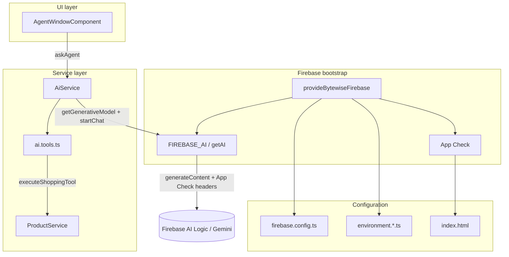
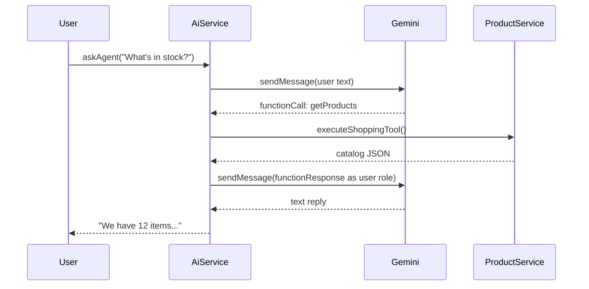

# ByteWise — How Firebase AI Logic works in this app

This guide walks through **how the shopping AI agent is wired**, from configuration files at the bottom of the stack up to the chat UI. Use it to learn Firebase AI Logic, App Check, and Gemini function calling in a real Angular app.

For Firebase Console setup (APIs, keys, deploy), see **[FIREBASE_SETUP.md](./FIREBASE_SETUP.md)**.

---

## Big picture

ByteWise is an ecommerce demo where a **Gemini** model acts as a shopping assistant. The model can **call functions** (tools) to read inventory and update the cart instead of guessing.

Three ideas hold the stack together:

1. **Firebase AI Logic** — the official JS SDK path to Gemini (`firebase/ai`), routed through `firebasevertexai.googleapis.com`.
2. **App Check** — every model request carries an attestation token (reCAPTCHA Enterprise in production, debug token on localhost).
3. **Function calling** — Gemini returns structured tool requests; your app runs them and sends results back until Gemini replies in plain language.



---

## Layer 1 — Configuration

Everything Firebase-related reads from a small set of config files. **No AI code runs here**; these files only supply credentials and environment flags.

### `src/environments/firebase.config.ts`

Shared Firebase web credentials and the reCAPTCHA Enterprise **site key** (public client key).

| Export | Purpose |
|--------|---------|
| `firebaseConfig` | `apiKey`, `projectId`, `appId`, etc. — identifies your Firebase project |
| `recaptchaEnterpriseSiteKey` | App Check attestation on production domains |

```typescript
export const firebaseConfig: FirebaseOptions = { /* from Firebase Console */ };
export const recaptchaEnterpriseSiteKey = '...'; // score-based Enterprise key
```

### `src/environments/environment.model.ts`

TypeScript interface `BytewiseEnvironment` so dev and prod environments stay consistent (`production`, `firebaseConfig`, `recaptchaEnterpriseSiteKey`, optional `appCheckDebugToken`).

### `src/environments/environment.ts` (production)

- `production: true`
- Imports shared `firebaseConfig` + reCAPTCHA key
- **No** `appCheckDebugToken` — production must use reCAPTCHA, not debug tokens

Loaded by default for `ng build`.

### `src/environments/environment.development.ts` (local dev)

- `production: false`
- `appCheckDebugToken: true` — tells the SDK to use the **App Check debug provider** on localhost

Swapped in via `angular.json` → `fileReplacements` when you run `ng serve`.

### `src/index.html`

Sets the debug flag **before** Angular bootstraps, only on localhost:

```html
<script>
  if (location.hostname === 'localhost' || location.hostname === '127.0.0.1') {
    self.FIREBASE_APPCHECK_DEBUG_TOKEN = true;
  }
</script>
```

The Firebase SDK reads `self.FIREBASE_APPCHECK_DEBUG_TOKEN` before `initializeAppCheck()`. On deployed Hosting, this script does nothing — users get reCAPTCHA Enterprise.

---

## Layer 2 — Application bootstrap

### `src/main.ts`

Bootstraps Angular with `appConfig`. No Firebase imports here — wiring is delegated to providers.

### `src/app/app.config.ts`

Registers app-wide providers. The only Firebase entry point:

```typescript
provideBytewiseFirebase(),
```

Call this **once**. All AI and App Check setup flows from here.

---

## Layer 3 — Firebase bootstrap (`src/app/firebase/`)

This folder is the **single place** that initializes Firebase App, App Check, and the AI Logic client. Services should not call `initializeApp()` or `getAI()` themselves.

### File map

| File | Role |
|------|------|
| `providers.ts` | `provideBytewiseFirebase()` — wires Angular DI |
| `app-check.ts` | App Check init (reCAPTCHA, debug, SSR placeholder) |
| `tokens.ts` | `FIREBASE_APP` and `FIREBASE_AI` injection tokens |
| `diagnostics.ts` | Dev-only localhost probes (not shipped to production users) |

### `providers.ts` — the heart of the integration

**One shared Firebase app** is created at module load:

```typescript
const firebaseApp = initializeApp(environment.firebaseConfig);
```

Using a single instance matters: App Check tokens are registered on this app; `getAI()` must use the **same** app or Gemini requests go out without attestation.

`provideBytewiseFirebase()` registers four providers:

| Provider | What it does |
|----------|----------------|
| `provideFirebaseApp(() => firebaseApp)` | AngularFire knows the app |
| `provideAppCheck(...)` | Calls `initializeBytewiseAppCheck()` |
| `FIREBASE_APP` | Typed token for the app instance |
| `FIREBASE_AI` | Factory `createFirebaseAI()` → `getAI()` |

**`createFirebaseAI()`** (important details):

```typescript
function createFirebaseAI(): AI {
  inject(AppCheck); // forces App Check to init before getAI

  return getAI(firebaseApp, {
    backend: new GoogleAIBackend(),           // Gemini Developer API
    useLimitedUseAppCheckTokens: environment.production, // replay protection in prod
  });
}
```

- **`GoogleAIBackend`** — Gemini via Firebase AI Logic (not raw Generative Language API key).
- **`inject(AppCheck)`** — guarantees initialization order: App Check first, then AI client.
- **`useLimitedUseAppCheckTokens`** — `true` in production for one-time tokens; `false` in dev to simplify debugging.

Requires **Firebase JS SDK 12.19.0+** for Gemini 3.x function calling (tool results use role `user`, not legacy `function`).

### `app-check.ts` — attestation

`initializeBytewiseAppCheck(firebaseApp, platformId)` handles three environments:

| Environment | Provider | Behavior |
|-------------|----------|----------|
| **SSR (Node)** | `CustomProvider` | Placeholder token; agent never calls Gemini on server |
| **Browser / production** | `ReCaptchaEnterpriseProvider` | Invisible score-based reCAPTCHA |
| **Browser / localhost** | Debug provider (via global flag + env) | Console prints a UUID to register in Firebase Console |

Flow on localhost:

1. `enableAppCheckDebugToken()` sets `FIREBASE_APPCHECK_DEBUG_TOKEN`
2. `initializeAppCheck()` with reCAPTCHA provider (SDK switches to debug when flag is set)
3. Optional dev logs + `logFirebaseLocalDiagnostics()`

### `tokens.ts` — dependency injection

```typescript
export const FIREBASE_APP = new InjectionToken<FirebaseApp>('FIREBASE_APP');
export const FIREBASE_AI = new InjectionToken<AI>('FIREBASE_AI');
```

Typed tokens avoid magic strings and make it obvious that **`AiService` must inject `FIREBASE_AI`**, not construct its own Gemini client.

### `diagnostics.ts` — dev-only troubleshooting

Runs only when **all** are true: browser platform, `!environment.production`, `isDevMode()`.

- Checks App Check token
- Runs a minimal `generateContent('ping')` probe
- Logs a troubleshooting checklist on failure

Production builds skip this entirely.

---

## Layer 4 — Tools and model config (`src/app/services/ai.tools.ts`)

Tool definitions live **separately** from the service so the model’s “API surface” is easy to read and extend.

| Export | Purpose |
|--------|---------|
| `SHOPPING_AGENT_MODEL` | e.g. `'gemini-3.8-flash'` — change model in one place |
| `SHOPPING_AGENT_SYSTEM_INSTRUCTION` | Persona, currency (KES), formatting rules |
| `shoppingTools` | `FunctionDeclarationsTool` — names, descriptions, JSON schemas |
| `executeShoppingTool()` | Runs a tool call against `ProductService` |

### Declared tools

| Function | What it does |
|----------|----------------|
| `getTotalNumberOfProducts` | Inventory count |
| `getProducts` | Full catalog |
| `clearCart` | Empty cart |
| `addToCart` | Add items by name/price (resolved to real `Product` records) |

Gemini **never executes** these functions. It returns a `functionCall`; your code runs `executeShoppingTool()` and sends a `functionResponse` back.

Parameter schemas use `Schema` from `firebase/ai` so the SDK validates declarations.

---

## Layer 5 — AI service (`src/app/services/ai.service.ts`)

The **only** service that talks to Gemini. The UI never imports `firebase/ai` directly.

### Dependencies

- `FIREBASE_AI` — Gemini client (App Check already attached)
- `ProductService` — cart/inventory source of truth
- `ai.tools.ts` — model name, system instruction, tools, executor

### Lazy chat session

```typescript
private chat: ChatSession | null = null;
```

The chat is created on the **first** `askAgent()` call so SSR does not open a Gemini session during server render.

### `getChat()` — model + tools

```typescript
const model = getGenerativeModel(this.ai, {
  model: SHOPPING_AGENT_MODEL,
  systemInstruction: SHOPPING_AGENT_SYSTEM_INSTRUCTION,
  tools: [shoppingTools],
});
this.chat = model.startChat();
```

### `askAgent(userPrompt)` — entry point

1. `chat.sendMessage(userPrompt)` — user text to Gemini
2. `resolveToolCalls()` — handle any tool requests
3. Return `result.response.text()` — final natural-language reply

### `resolveToolCalls()` — function-calling loop

Gemini function calling is a **loop**, not one request:



Implementation sketch:

```typescript
const functionResponses = functionCalls.map((call) => ({
  functionResponse: {
    name: call.name,
    ...(call.id !== undefined ? { id: call.id } : {}), // required for Gemini 3.x
    response: executeShoppingTool(call, this.productService),
  },
}));
result = await chat.sendMessage(functionResponses);
```

The loop runs up to `MAX_TOOL_ROUNDS` (8) to prevent runaway tool chains.

---

## Layer 6 — UI (`src/app/components/agent-window/`)

### `agent-window.component.ts`

- Injects `AiService` (not Firebase directly)
- `sendMessage()` → `aiService.askAgent(userQuestion)`
- Shows thinking state, appends user/assistant messages to a signal-based history
- `describeAgentError()` — maps Firebase errors to shopper-friendly messages (App Check, API key, SDK version, etc.)
- Optional voice input via `SpeechRecognitionService` (unrelated to Firebase AI)

### Where it appears

- `src/app/app.component.html` — `<app-agent-window></app-agent-window>`
- `src/app/app.component.ts` — imports `AgentWindowComponent`

The agent is global overlay UI, available on every page.

---

## What happens on each Gemini request

When `chat.sendMessage()` or `generateContent()` runs, the Firebase AI SDK (v12.19+) sends an HTTP **POST** to:

```text
https://firebasevertexai.googleapis.com/v1beta/projects/<project-id>/models/<model-id>:generateContent
```

Important headers (visible in DevTools → Network):

| Header | Source |
|--------|--------|
| `x-goog-api-key` | `firebaseConfig.apiKey` |
| `X-Firebase-AppCheck` | App Check token (debug or reCAPTCHA) |
| `X-Firebase-Appid` | Web app ID (when analytics collection enabled) |

The API key **identifies** the project; **authorization** for Gemini goes through Firebase AI Logic + App Check + the project’s service agent (provisioned when you run **AI Logic → Get started** in the console).

---

## Security model (summary)

| Concern | How this app handles it |
|---------|-------------------------|
| **Abuse / bots** | App Check enforced on Firebase AI Logic |
| **Local dev** | Debug token registered in Console (not reCAPTCHA on localhost) |
| **Production** | reCAPTCHA Enterprise site key + domain allowlist |
| **Replay attacks** | Limited-use App Check tokens in production (`useLimitedUseAppCheckTokens: true`) |
| **API key in repo** | Expected for client apps; restrict key to AI Logic + App Check APIs only |
| **System prompt in bundle** | Visible in client; Firebase recommends server prompt templates for hardening |

---

## Full file reference (AI-related)

```text
src/
├── index.html                          # localhost App Check debug flag
├── main.ts                             # Angular bootstrap
├── environments/
│   ├── environment.model.ts            # Env interface
│   ├── environment.ts                  # Production env
│   ├── environment.development.ts      # Dev env + debug token flag
│   └── firebase.config.ts              # Firebase + reCAPTCHA site key
└── app/
    ├── app.config.ts                   # provideBytewiseFirebase()
    ├── app.component.html              # Hosts <app-agent-window>
    ├── firebase/
    │   ├── providers.ts                # App + App Check + getAI()
    │   ├── app-check.ts                # reCAPTCHA / debug / SSR
    │   ├── tokens.ts                   # FIREBASE_APP, FIREBASE_AI
    │   └── diagnostics.ts              # Dev-only probes
    ├── services/
    │   ├── ai.service.ts               # Chat + tool loop
    │   ├── ai.tools.ts                 # Model, tools, executeShoppingTool
    │   └── product.service.ts          # Inventory/cart (tool backend)
    └── components/
        └── agent-window/
            ├── agent-window.component.ts   # Chat UI → askAgent()
            ├── agent-window.component.html
            └── agent-window.component.scss
```

**Dependencies:** `firebase` ^12.19.0, `@angular/fire` ^19.1.0

**Related docs in repo:**

- [FIREBASE_SETUP.md](./FIREBASE_SETUP.md) — Console and deploy checklist
- [Firebase AI Logic docs](https://firebase.google.com/docs/ai-logic)
- [App Check with AI Logic](https://firebase.google.com/docs/ai-logic/app-check)

---

## Extending the agent (for learners)

1. **New store action** — Add a declaration in `shoppingTools` **and** a case in `executeShoppingTool()`.
2. **Different model** — Change `SHOPPING_AGENT_MODEL` in `ai.tools.ts`.
3. **Stricter prompts** — Edit `SHOPPING_AGENT_SYSTEM_INSTRUCTION` or move to Firebase prompt templates.
4. **Second agent** — Inject `FIREBASE_AI`, create another service with its own tools/model; reuse the same bootstrap.
5. **Vertex / Agent Platform** — In `providers.ts`, swap `GoogleAIBackend` for `AgentPlatformBackend` (see Firebase docs).

---

## Mental model checklist

When debugging or teaching, ask in order:

1. **Config** — Is `firebase.config.ts` filled in for the right project?
2. **Console** — AI Logic Get started done? App Check enforced? Debug token registered (localhost)?
3. **Bootstrap** — Is `provideBytewiseFirebase()` in `app.config.ts`?
4. **App Check** — Does Network show `X-Firebase-AppCheck` on `generateContent`?
5. **SDK version** — 12.19.0+ for Gemini 3 function calling?
6. **Tools** — Does Gemini return `functionCalls()` and does `executeShoppingTool` handle them?
7. **UI** — Does `AgentWindowComponent` call `askAgent()` and display the text result?

That path mirrors the code: **config → bootstrap → attestation → client → tools → service → UI**.
