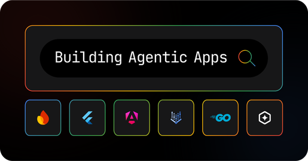

# ByteWise

## About This Codelab

This is a codelab that demonstrates how to build an AI-powered e-commerce application using Angular and Google's Firebase AI Logic. Through this codelab, developers can learn how to implement:

- Integration with Google's Firebase AI Logic and Gemini 2.0 model
- AI-powered shopping assistant with natural language processing
- Voice recognition for hands-free interaction with the AI assistant
- Function calling capabilities to perform actions like retrieving product information and adding items to cart
- Reactive state management using Angular signals
- Modern Angular features including standalone components

## About The App

ByteWise is an e-commerce platform that showcases electronic products with an integrated AI shopping assistant. The application features:

- Product catalog with detailed product information
- AI assistant that can answer questions about products
- Voice recognition for hands-free interaction with the AI assistant
- Shopping cart functionality
- Responsive UI with modern design

This project was generated using [Angular CLI](https://github.com/angular/angular-cli) version 19.2.9.

## Setting Up Your Angular Project for Firebase AI Logic 🚀

This guide will walk you through the initial setup required to run the Angular example that demonstrates the integration of Firebase AI Logic within a Firebase project.

### Understanding the Architecture 🏗️

In this example, Angular serves as the front-end framework, providing the user interface for interacting with our tech gadget inventory. We leverage the AngularFire library to seamlessly connect this Angular application to your Firebase project. The exciting part is Firebase AI Logic, which allows us to tap into powerful AI models directly from our Firebase backend. This enables features like intelligent chat sessions and the use of tools that empower the AI agent to perform actions (such as accessing inventory details).

### Try it out in Firebase Studio 🧪

Click this button to launch the project in Firebase Studio and follow the steps below to get started.

<a href="https://studio.firebase.google.com/import?url=https%3A%2F%2Fgithub.com%2Fwaynegakuo%2Fbytewise">
  <picture>
    <source
      media="(prefers-color-scheme: dark)"
      srcset="https://cdn.firebasestudio.dev/btn/try_dark_32.svg">
    <source
      media="(prefers-color-scheme: light)"
      srcset="https://cdn.firebasestudio.dev/btn/try_light_32.svg">
    
  </picture>
</a>


### Setting up Locally: Prerequisites ✅

Before we begin, ensure you have the following installed on your machine:

- **Node.js and npm (or yarn)** 📦: Angular relies on Node.js for its development environment and npm (Node Package Manager) or yarn for managing dependencies.
  - **Installation**: If you haven't already, download and install Node.js from the official website: https://nodejs.org/. npm is typically included with Node.js. You can also choose to install yarn: `npm install --global yarn`.

- **Angular CLI (Command Line Interface)** 🛠️: The Angular CLI is a powerful tool for creating, managing, and building Angular applications.
  - **Installation**: Open your terminal or command prompt and install the Angular CLI globally:
  ```bash
  npm install -g @angular/cli
  ```
  or
  ```bash
  yarn global add @angular/cli
  ```

### Firebase Project and Firebase AI Logic Setup 🔥

Next, you'll need a Firebase project with a web application configured. You will also need to enable Firebase AI Logic on your Firebase project.

Follow the directions in [Step 1 to create a project and a web app](https://firebase.google.com/docs/vertex-ai/get-started?platform=web). You do not need to add any SDK code snippets during this step, as this example project already includes them.

### Getting the Code 📥

Now, let's obtain the bytewise code from GitHub:

Open your terminal or command prompt and navigate to the directory where you want to store the project. Then, use the following command to clone the repository:

```bash
# Clone using HTTPS
git clone https://github.com/waynegakuo/bytewise.git
```

Alternatively, if you have configured SSH keys for GitHub, you can use:

```bash
# Clone using SSH
git clone git@github.com:waynegakuo/bytewise.git
```

### Navigating to the Project and Installing Dependencies 📁

Once the repository is cloned, navigate into the project directory.

Next, install the necessary dependencies for the project using npm or yarn:

```bash
# Using npm
npm install
```

or

```bash
# Using yarn
yarn install
```

### Configuring Firebase Project Settings ⚙️

Before running the application, you need to provide your Firebase project credentials. Open the `src/app/environments/environments.ts` file in your code editor and replace the placeholder values within the firebaseConfig object with your actual Firebase project settings. You can find these details in the Firebase Console under your project's settings.

```typescript
export const environment = {
  production: false,
  firebaseConfig: {
    apiKey: "<your-api-key>",
    authDomain: "<your-app-domain>",
    projectId: "<your-project-id>",
    storageBucket: "<your-storage-bucket-id>",
    messagingSenderId: "<your-message-sender-id>",
    appId: "<your-app-id>",
    measurementId: "<your-measurement-id>"
  },
};
```

### Running the Application 🏃‍♂️

With the configuration complete, you can now start the development server:

```bash
ng serve
```

This command will build your Angular application and start a local development server. You can then access the application in your web browser at http://localhost:4200.

### Exploring the Application 🔍

Once the app is running, you can interact with the shopping agent by asking questions like:
- Do you sell shoes here?
- What items are in stock?
- What is the most expensive item?

You can also use the voice recognition feature by clicking the microphone button in the chat interface. When the microphone is active, speak your question clearly, and the application will automatically transcribe your speech and send it to the AI assistant when you finish speaking.

### How the Application Integrates with Firebase AI Logic 🧠

The core logic for interacting with the Firebase AI Logic API resides in the `src/app/services/ai.service.ts` file. You'll find the initialization of the Firebase AI Logic service there:

```typescript
import { getVertexAI } from 'firebase/vertexai';
// ... other imports

const vertexAI = getVertexAI(this.firebaseApp);
```

This example showcases how to provide the AI agent with access to custom tools. In this case, the agent can utilize functions to access the inventory and add items to a virtual cart. These functions are implemented within the example and passed to the agent through the tools property when calling the getGenerativeModel function.

For a deeper understanding of the application's structure and how the UI interacts with the AI service, explore the code.

### Speech Recognition Integration 🎤

The application integrates browser-based speech recognition through the Web Speech API. The implementation is in `src/app/services/speech-recognition.service.ts`, which provides:

- Cross-browser support for speech recognition
- Real-time transcription of speech to text
- Reactive state management using RxJS observables
- Seamless integration with the AI assistant

The speech recognition service is used in the agent window component to enable voice input, allowing users to interact with the AI assistant hands-free. When a user speaks, their speech is transcribed and automatically sent to the AI assistant for processing.

You're now all set to explore this Angular application integrated with Firebase AI Logic! This example provides a solid foundation for understanding how to build interactive and intelligent web applications. 🎉

## Development server

To start a local development server, run:

```bash
ng serve
```

Once the server is running, open your browser and navigate to `http://localhost:4200/`. The application will automatically reload whenever you modify any of the source files.

## Code scaffolding

Angular CLI includes powerful code scaffolding tools. To generate a new component, run:

```bash
ng generate component component-name
```

For a complete list of available schematics (such as `components`, `directives`, or `pipes`), run:

```bash
ng generate --help
```

## Building

To build the project run:

```bash
ng build
```

This will compile your project and store the build artifacts in the `dist/` directory. By default, the production build optimizes your application for performance and speed.

## Running unit tests

To execute unit tests with the [Karma](https://karma-runner.github.io) test runner, use the following command:

```bash
ng test
```

## Running end-to-end tests

For end-to-end (e2e) testing, run:

```bash
ng e2e
```

Angular CLI does not come with an end-to-end testing framework by default. You can choose one that suits your needs.

## License

This project is licensed under the MIT License - see the [LICENSE](LICENSE) file for details.

## Additional Resources
For learning more about building agentic apps, visit [Building Agentic Apps in Angular & Flutter](https://flutter.dev/events/building-agentic-apps).

Learn more about [Firebase AI Logic](https://firebase.google.com/docs/vertex-ai)

Learn more about [building with Gemini](https://firebase.google.com/docs/studio/build-gemini-api-app)



For more information on using the Angular CLI, including detailed command references, visit the [Angular CLI Overview and Command Reference](https://angular.dev/tools/cli) page.
