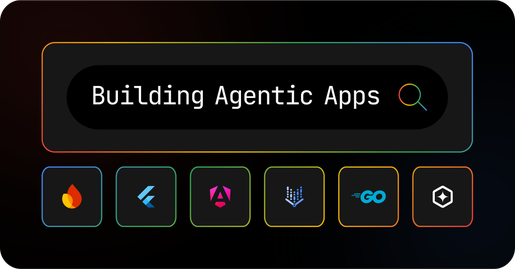

# ByteWise

## About This Codelab

This codelab demonstrates how to build an AI-powered e-commerce application using **Angular 19** and **Firebase AI Logic** (Gemini). You will learn:

- **Firebase AI Logic** with the `firebase/ai` SDK and **Gemini 3.x** models
- **App Check** with reCAPTCHA Enterprise (production) and debug tokens (localhost)
- **Function calling** — Gemini invokes your tools to read inventory and update the cart
- A **shopping assistant** with natural-language chat and optional voice input
- **Angular signals**, standalone components, and a DRY Firebase bootstrap

## About The App

ByteWise is an ecommerce demo for tech gadgets with an integrated AI shopping assistant:

- Product catalog with detailed product pages
- AI agent that answers inventory questions and adds items to the cart
- Voice recognition for hands-free chat (Web Speech API)
- Shopping cart with reactive state
- Responsive UI

Generated with [Angular CLI](https://github.com/angular/angular-cli) 19.2.9. Uses **Firebase JS SDK 12.19.0+** (required for Gemini 3 function calling).

---

## Codelab: Setting Up Firebase AI Logic

### Understanding the Architecture

Angular provides the UI. **Firebase AI Logic** connects your app to **Gemini** through Google's managed backend (`firebasevertexai.googleapis.com`). **App Check** attests that requests come from your real app before Gemini will respond.

The AI stack is organized in layers (config → bootstrap → tools → service → UI). For a full walkthrough with diagrams and file references, read:

- **[FIREBASE_AI_ARCHITECTURE.md](./FIREBASE_AI_ARCHITECTURE.md)** — how the code works (start here after setup)
- **[FIREBASE_SETUP.md](./FIREBASE_SETUP.md)** — Firebase Console checklist for your own project

```text
Configuration (firebase.config.ts, environments)
        ↓
Bootstrap (provideBytewiseFirebase → App Check + getAI)
        ↓
Tools (ai.tools.ts — model, system prompt, function declarations)
        ↓
Service (ai.service.ts — chat + function-calling loop)
        ↓
UI (agent-window.component.ts — calls askAgent())
```

### Try it in Firebase Studio

<a href="https://studio.firebase.google.com/import?url=https%3A%2F%2Fgithub.com%2Fwaynegakuo%2Fbytewise">
  <picture>
    <source media="(prefers-color-scheme: dark)" srcset="https://cdn.firebasestudio.dev/btn/try_dark_32.svg">
    <source media="(prefers-color-scheme: light)" srcset="https://cdn.firebasestudio.dev/btn/try_light_32.svg">
    
  </picture>
</a>

Then follow the local setup steps below.

---

### Step 1 — Prerequisites

Install on your machine:

| Tool | Purpose |
|------|---------|
| **Node.js 18+** and **npm** | [nodejs.org](https://nodejs.org/) |
| **Angular CLI** | `npm install -g @angular/cli` |
| **Firebase CLI** (optional, for deploy) | `npm install -g firebase-tools` |

---

### Step 2 — Create a Firebase project

You need your **own** Firebase project. Follow **[FIREBASE_SETUP.md](./FIREBASE_SETUP.md)** in order:

1. Create a Firebase project (pick a **Project ID** — it becomes your Hosting URL: `https://<project-id>.web.app`)
2. Register a **Web app** and copy the `firebaseConfig` object
3. **AI Logic → Get started → Gemini Developer API** (do this early — provisions APIs and the service agent)
4. Create a **reCAPTCHA Enterprise** site key (score-based) and register it in **App Check**
5. Restrict your **Browser API key** to **Firebase AI Logic API** + **Firebase App Check API** only (not Generative Language API)

---

### Step 3 — Clone the repo and install

```bash
git clone https://github.com/waynegakuo/bytewise.git
cd bytewise
npm install
```

---

### Step 4 — Configure credentials

#### 4a. Firebase config

Open **`src/environments/firebase.config.ts`** and paste your values from Firebase Console → Project settings → Your apps → Web:

```typescript
export const firebaseConfig: FirebaseOptions = {
  apiKey: '...',
  authDomain: '<project-id>.firebaseapp.com',
  projectId: '<project-id>',
  storageBucket: '<project-id>.firebasestorage.app',
  messagingSenderId: '...',
  appId: '...',
  measurementId: '...',
};

export const recaptchaEnterpriseSiteKey = '...'; // from reCAPTCHA Enterprise (step 2)
```

#### 4b. Firebase CLI project (for deploy)

Set your project ID in **`.firebaserc`**:

```json
{
  "projects": {
    "default": "<project-id>"
  }
}
```

Development settings (`appCheckDebugToken: true`) live in **`src/environments/environment.development.ts`** — you usually do not need to change this file.

---

### Step 5 — Register the App Check debug token (localhost only)

reCAPTCHA does **not** run on `localhost`. The app uses App Check's **debug provider** instead.

1. Run the app: `ng serve`
2. Open **http://localhost:4200** and DevTools → **Console**
3. Find: `AppCheck debug token: "xxxxxxxx-xxxx-..."`
4. Firebase Console → **App Check** → your **web app** → **Manage debug tokens** → add that UUID
5. Hard refresh (`Ctrl+Shift+R`)

In the console you should see **`[ByteWise] Gemini generateContent probe: OK`**. These diagnostics run **only in dev** — not in production builds.

---

### Step 6 — Run and explore

```bash
ng serve
```

Open **http://localhost:4200**. Try the shopping agent:

- *What items are in stock?*
- *How many products do you have?*
- *Add the cheapest item to my cart.*

Use the **microphone** button for voice input (Chrome/Edge recommended).

---

## What Learners Should Look For in the Code

Use this as a guided tour. Read **[FIREBASE_AI_ARCHITECTURE.md](./FIREBASE_AI_ARCHITECTURE.md)** for detail on each layer.

### Layer 1 — Configuration

| File | What to notice |
|------|----------------|
| `src/environments/firebase.config.ts` | Single source for `firebaseConfig` + reCAPTCHA site key |
| `src/environments/environment.development.ts` | `appCheckDebugToken: true` for localhost |
| `src/environments/environment.ts` | Production — no debug token |
| `src/index.html` | Sets `FIREBASE_APPCHECK_DEBUG_TOKEN` on localhost only |

**Learning goal:** Understand why credentials and App Check mode differ between dev and production.

### Layer 2 — Firebase bootstrap

| File | What to notice |
|------|----------------|
| `src/app/app.config.ts` | Calls `provideBytewiseFirebase()` once |
| `src/app/firebase/providers.ts` | One `initializeApp`, then App Check, then `getAI()` with `GoogleAIBackend` |
| `src/app/firebase/app-check.ts` | reCAPTCHA Enterprise vs debug provider vs SSR placeholder |
| `src/app/firebase/tokens.ts` | `FIREBASE_AI` injection token — services inject this instead of calling `getAI()` directly |

**Learning goal:** App Check must initialize on the **same** Firebase app instance before any Gemini call. See `inject(AppCheck)` inside `createFirebaseAI()`.

### Layer 3 — Tools and model

| File | What to notice |
|------|----------------|
| `src/app/services/ai.tools.ts` | `SHOPPING_AGENT_MODEL`, system instruction, `shoppingTools` declarations, `executeShoppingTool()` |

**Learning goal:** Gemini does not run your functions — it returns `functionCall` objects. You execute them and send back `functionResponse` parts.

### Layer 4 — AI service

| File | What to notice |
|------|----------------|
| `src/app/services/ai.service.ts` | `getGenerativeModel()` + `startChat()`, `askAgent()`, `resolveToolCalls()` loop |

**Learning goal:** Trace one user message: `sendMessage(text)` → optional tool rounds → final `response.text()`.

### Layer 5 — UI

| File | What to notice |
|------|----------------|
| `src/app/components/agent-window/agent-window.component.ts` | Calls `aiService.askAgent()` — never imports `firebase/ai` |
| `src/app/app.component.html` | Hosts `<app-agent-window>` globally |

**Learning goal:** Keep Firebase AI out of components; the service is the boundary.

### Optional — Dev diagnostics

| File | What to notice |
|------|----------------|
| `src/app/firebase/diagnostics.ts` | Localhost-only App Check + Gemini probe (skipped when `production: true`) |

---

## Codelab Checklist

Before moving on, confirm you can explain each item:

- [ ] What **AI Logic → Get started** provisions in your Firebase project
- [ ] Why **App Check** is required for Gemini on the client
- [ ] Difference between **reCAPTCHA** (production) and **debug tokens** (localhost)
- [ ] Why the Browser API key allows **Firebase AI Logic** + **App Check** APIs but **not** Generative Language API
- [ ] Where **`provideBytewiseFirebase()`** fits in the Angular injector
- [ ] How **`shoppingTools`** connects to **`executeShoppingTool()`**
- [ ] What happens in **`resolveToolCalls()`** when Gemini asks for inventory

---

## Speech Recognition

Voice input uses the **Web Speech API** in `src/app/services/speech-recognition.service.ts`:

- Cross-browser speech recognition (best in Chrome/Edge)
- Transcript fed into the same `askAgent()` path as typed messages
- Independent of Firebase — no extra Firebase setup required

---

## Build, Test, Deploy

```bash
# Development
ng serve

# Production build
ng build

# Deploy to Firebase Hosting (after firebase login + firebase use <project-id>)
firebase deploy --only hosting
```

For CI/CD, add a GitHub secret `FIREBASE_SERVICE_ACCOUNT_BYTEWISE` with your project's service account JSON (see **FIREBASE_SETUP.md** § GitHub Actions).

---

## Additional Resources

| Resource | Link |
|----------|------|
| Architecture guide (this repo) | [FIREBASE_AI_ARCHITECTURE.md](./FIREBASE_AI_ARCHITECTURE.md) |
| Firebase setup guide (this repo) | [FIREBASE_SETUP.md](./FIREBASE_SETUP.md) |
| Firebase AI Logic docs | [firebase.google.com/docs/ai-logic](https://firebase.google.com/docs/ai-logic) |
| App Check + AI Logic | [firebase.google.com/docs/ai-logic/app-check](https://firebase.google.com/docs/ai-logic/app-check) |
| Building agentic apps | [flutter.dev/events/building-agentic-apps](https://flutter.dev/events/building-agentic-apps) |
| Angular CLI reference | [angular.dev/tools/cli](https://angular.dev/tools/cli) |



---

## License

MIT — see [LICENSE](LICENSE).
